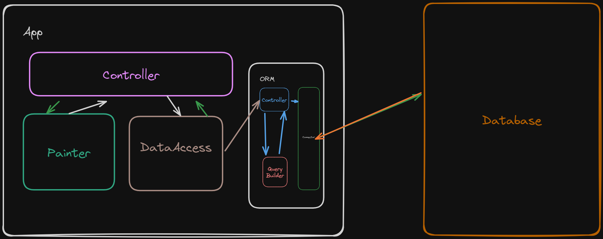

# Alpha3
# Author
- Name: Anton Kalashnikov
- Contact me: kalashnikov004@gmail.com - email
- Creation date: 4.2.2024
- School: SPŠE Ječná
- Project type: School project

# Program start
* Pre-requisites:
*	Have Python interpreter installed
* 	Have MySQL database installed
This application is made for command line so to use it you need to open cmd
and using cd go to root folder of the applications (its where you can see main.py or config.conf).
Write python main.py

# Program flow

